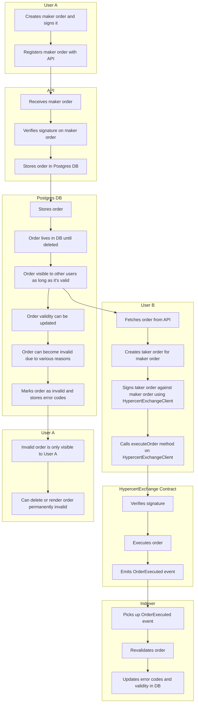

# @hypercerts-org/marketplace-sdk

   

A collection of typescript tools to interact with HypercertsExchange smart contracts, enable users to sell and buy Hypercerts on the marketplace.


## SDK usage

Read the [guides](./docs/guides) if you need help with the implementation.

You can also read the detailed [api documentation](./doc).

## SDK development

### Environment variables

No environment variables are required to run build the SDK or run the tests.

### Local development

The `HypercertExchangeClient()` allows you to override the api endpoint. This can be useful for developing against a local instance of the API.

To use a locally built version of the SDK in another project, you can use `pnpm link`:

```bash
cd marketplace-sdk
pnpm link
cd ../your-project
pnpm link @hypercerts-org/marketplace-sdk
```

## Scripts

- `dev` - Run the SDK in development mode
- `build` - Build the SDK
- `test` - Run the tests
- `docs` - Generate the documentation into the `doc` folder
- `supabase:types:hypercerts` - Generate types for the `data-staging` database

## Lifecycle of an order

1. User A creates maker order and signs it
1. User A registers maker order with API
1. Signature on maker order gets verified
1. Order gets stored in data postgres DB
1. Order will live in DB until deleted
1. Order will be visible to other users as long as it's valid.
1. An order being executed or canceled (or many other reasons) might render it being invalid.
    1. User B fetches order from API
    1. User B creates taker order for maker order
    1. User B signs taker order against maker order using the `HypercertExchangeClient`
    1. User B calls the `executeOrder` method on the `HypercertExchangeClient` with the taker order, which calls the `HypercertExchange` contract in turn.
    1. The `HypercertExchange` contract verifies the signature and executes the order
    1. The `HypercertExchange` contract will emit an event that the order has been executed, which is picked up by the indexer which revalidates the order and updates the errors codes and validity in the DB.
    [!WARNING] Not implemented yet
    The indexer is not listing to the `OrderExecuted` event yet, so the order will not be updated in the DB, unless reverified manually.
1. Once an maker order is invalidated it's only visible to User A.
1. Maker order can be deleted or permanently rendered invalid by declaring the nonce invalid by User A at any time.



## Data

Order information and nonces live in the `data-staging` and `data-production` database. Nonces are invalidated on-chain, but keeping track of the current nonce for a user happens off-chain in the DB. Orders do not live on-chain, but as they are signed they can be verified.

## Architecture

